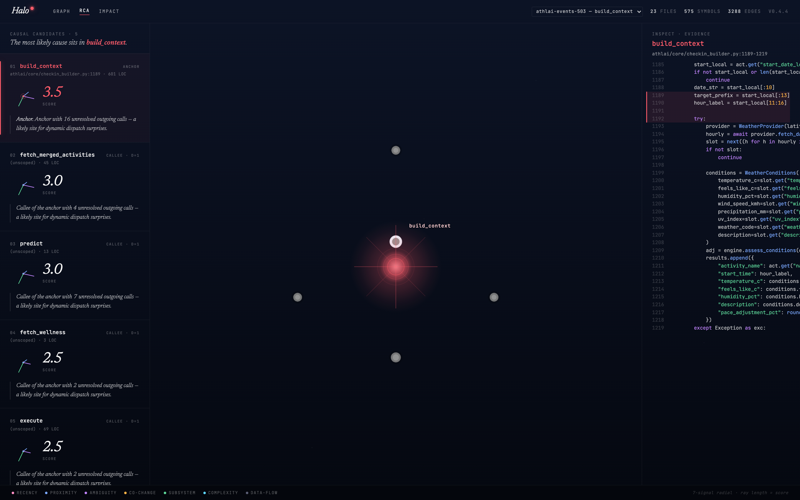

<div align="center">

# Halo

**Structural facts about your code, exposed to any AI agent over MCP.**

`code-graph-rca` · `cgrca` · MIT

</div>

When an AI agent investigates a failure in your repo, it needs to know more than what the code *says*. It needs to know what calls what, what changed recently, where data flows, who depends on what. That context lives in your AST and your git history. Halo extracts it, indexes it, and exposes it as MCP tools an agent can call.

The agent stays the agent. Halo is the structural eyes and memory it didn't have.



## What Halo does

A long-lived daemon parses your repo with tree-sitter, builds a call graph + import graph + symbol index in SQLite, and watches the filesystem. A calibrated 7-signal scorer ranks symbols by recency × proximity × ambiguity × co-change × subsystem × complexity × dataflow.

That graph + scorer is exposed to any MCP-aware editor (Cursor, Claude Code, Cody, Cline, Continue, Windsurf, Zed) as ten tools:

| Tool | What it answers |
|---|---|
| `cgrca_definitionOf` | Where is this symbol declared? File, line range, signature, exported flag, language, subsystem. |
| `cgrca_callersOf` | Who calls this? Reverse call tree to depth N, deduped, with confidence. |
| `cgrca_calleesOf` | What does this call? Forward call tree. Unresolved targets surface as grep-bait for the agent. |
| `cgrca_pathBetween` | How does data flow from A to B? Shortest path over CALLS + arg-binding edges. |
| `cgrca_recentlyChangedNear` | Who changed this lately? `git log -L` per symbol's lines, last N commits. |
| `cgrca_symbolsInFile` | What's in this file? Quick file-level survey. |
| `cgrca_rca` | Full ranked-candidate RCA from a stack trace, failing test, symbol, or file. |
| `cgrca_rcaPrompt` | Same, but returns the assembled markdown prompt — drop straight into a reasoning loop. |
| `cgrca_rcaWithReasoning` | LLM-augmented RCA via the host's LLM. |
| `cgrca_enrichCandidates` | Take any `(file, symbol)` candidate set and annotate each with body + callers + callees + recent commits. |

Plus `cgrca_scope`, `cgrca_currentSelection`, `cgrca_publishSelection` for advanced flows.

## What this resolves

**Wasted triage time.** When an agent has to guess at code structure, it loops — reading files, re-reading them, asking the user for hints, hallucinating function names. With Halo, the first three tool calls usually anchor the investigation in the right subsystem.

**Off-target file picks.** The 7-signal scorer rewards code that recently changed in the failure's neighborhood, that's structurally close to the entry point, and that co-changes with related fixes. The agent's ranked candidates reflect how engineers actually triage, not what the prose superficially mentions.

**Stale context.** Static documentation goes out of date the day after it's written. The graph is rebuilt from your code and your git log, every time.

**Manual integration work.** `cgrca init` detects which MCP-aware editors you have, registers the tools, and drops an `AGENTS.md` so the agent knows when to call which tool. Zero config in the editor itself.

## Install

```sh
npm i -g code-graph-rca            # CLI + MCP server + daemon
npm i -g code-graph-rca-ui         # Constellation / RCA / Impact viewer (optional)
npm i -g code-graph-rca-github-app # PR review + incident webhook bot (optional)
```

## 30-second start

```sh
cd your-repo
cgrca init --yes        # detect editors, register MCP, drop AGENTS.md
cgrca daemon start      # warm queries — sub-50ms on the second hit
```

Open your editor. Halo's MCP tools are now available to your agent.

**Run an RCA from the CLI:**

```sh
cgrca rca symbol:login              # ranked candidates printed as a table
                                    # sidecar auto-written to ~/.cgrca/repos/
                                    # UI reloads automatically if open
```

**Open the visual viewer:**

```sh
cgrca-view ~/.cgrca/repos           # opens browser at 127.0.0.1:7331
                                    # switch to the RCA tab — type any symbol,
                                    # file, or failure description to investigate
```

No `--persist` flag, no session files to manage, no browser refresh needed. The CLI writes to the daemon's canonical SQLite and notifies the viewer over the bridge.

## A concrete example

Failure: *"users randomly get logged out mid-session, no error in the auth handler."*

The agent calls Halo:

- `recentlyChangedNear("SessionStore.touch")` → "Modified 6 days ago in commit `a8f3` — *'rotate session keys on idle'*."
- `callersOf("rotate_keys")` → "Called from `middleware.before_request` (2 hops upstream of every endpoint)."
- `pathBetween("Request.cookies", "rotate_keys")` → "Flows via `middleware/cookies.py:54` → `session/store.py:118`."

The 7-signal scorer ranks `rotate_keys@session/store.py:118` at #1: high recency × short proximity to the failure surface × strong co-change with the auth subsystem.

The agent now has the structural evidence to commit to a hypothesis and propose a fix.

## Three surfaces

**MCP server** — the actual product. Stdio transport, every MCP-aware editor picks it up. `cgrca init` does the wiring.

**CLI** — for scripting, CI, debugging. `cgrca rca` uses the daemon's warm index when available, falls back to in-process:

```sh
cgrca rca symbol:login                                 # rank a known symbol
cgrca rca file:src/auth.py                             # rank within a file
cgrca rca test:tests/test_auth.py                      # from a failing test
cgrca rca "users randomly get logged out"              # free-text
cgrca rca "users randomly get logged out" --llm        # LLM re-rank (needs ANTHROPIC_API_KEY)
cgrca callers handle_login --depth 3                   # walk the call graph
cgrca define UserSession --language python             # find declarations
cgrca changed handle_login --since 30                  # who touched this lately
```

**Visual viewer** (`code-graph-rca-ui`) — three tabs over the same indexed graph:

- **Constellation** — force-directed call graph, causal halos sized by score, recency rings, Monaco source panel on click.
- **RCA Evidence Board** — live query bar at the top. Type `symbol:X`, `file:src/foo.py`, or a plain description and hit Investigate. Results appear in seconds, no session file needed. Candidates render as 7-signal dossiers with commit history and source excerpts.
- **Impact Forward Constellation** — blast-radius projection from any symbol: tree view, risk table, file rollup.

**GitHub App + incident webhook** — PR review bot posts ranked candidates as a comment; Sentry / generic webhooks open issues with ranked candidates and a first hypothesis.

## Architecture

**Scope-then-index.** A bounded BFS over imports + reverse callers picks 5–10k LOC around the failure. A two-pass tree-sitter parser builds an in-memory SQLite (persisted automatically to `~/.cgrca/repos/` by the daemon).

**Calibrated scorer.** Seven signals — recency, proximity, ambiguity, co-change, subsystem, complexity, dataflow — fit by logistic regression. Tooling in [`tools/calibration/`](tools/calibration/).

**`cgrcad` daemon.** Long-lived process owning one persisted SQLite per repo, keyed by realpath. Blob-sha cache skips re-parsing unchanged files; fs-watcher invalidates on edit. JSON-RPC over a unix socket. Warm queries land in ~30ms. `cgrca rca` tries the daemon first and falls back to in-process if it's down.

**Bridge.** `cgrca-view` writes `~/.cgrca/bridge.json` on start. The CLI reads it after every sidecar write and POSTs to `/api/bridge/rca-notify`, which broadcasts a `rca-updated` WebSocket event to the viewer — the RCA tab reloads without a manual refresh.

**Schema.** Files, symbols (with `body_preview`), edges with confidence, imports, params, arg_bindings, blob_cache. Schema versioning is enforced — newer binary refuses older DBs.

Deep dive: [`docs/ARCHITECTURE.md`](docs/ARCHITECTURE.md).

## Performance

- Warm queries via daemon: <50ms p95 on a ~17k-file repo.
- 91.3% Python identifier resolution (receiver-type inference resolves `self.foo()` and `obj.method()` to the right class).
- Cold index: roughly 6 seconds for a 1500-file Python repo.

## Documentation

- [`docs/ARCHITECTURE.md`](docs/ARCHITECTURE.md) — scope-then-index, schema, two-pass design
- [`docs/RCA_PROTOCOL.md`](docs/RCA_PROTOCOL.md) — the seven-step protocol embedded in every Halo prompt
- [`docs/EXTENDING.md`](docs/EXTENDING.md) — adding a language
- [`packages/core/README.md`](packages/core/README.md) — engine details, all CLI flags
- [`packages/ui/README.md`](packages/ui/README.md) — Observatory viewer
- [`packages/github-app/README.md`](packages/github-app/README.md) — PR review + incident webhooks
- [`CONTRIBUTING.md`](CONTRIBUTING.md) — project layout, tests, coding standards

## Status

MIT · 351 tests · active development. Bug reports and PRs welcome.

---

<sub>*Halo* is the brand; `code-graph-rca` is the npm namespace; `cgrca` is the binary.</sub>
